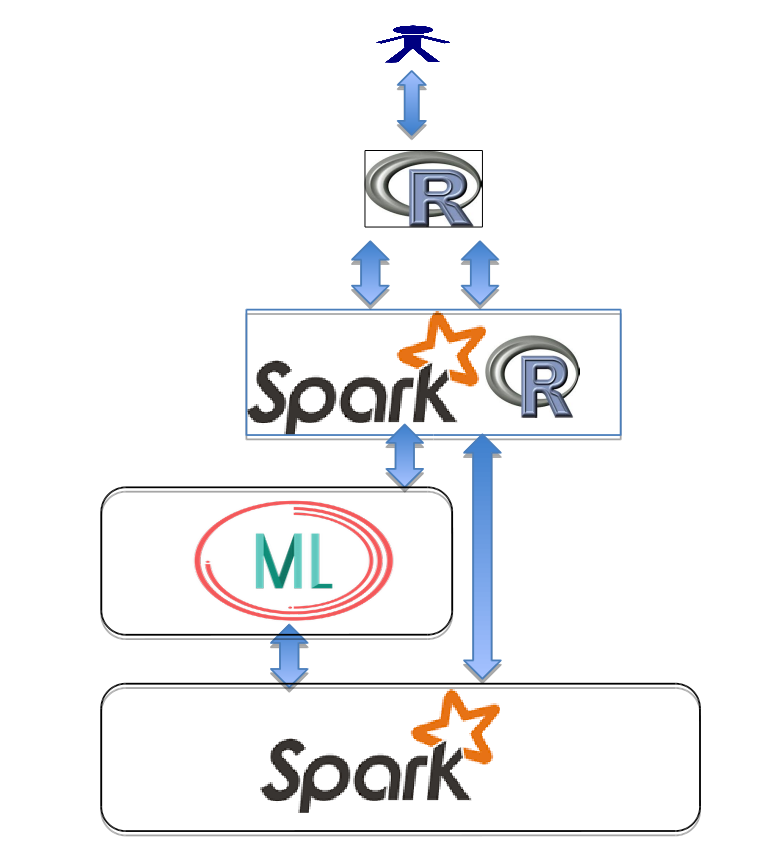

# 

# __**What is R4ML?**__

R4ML is a scalable, hybrid approach to ML/Stats using R, Apache SystemML, and Apache Spark

## __**R4ML Key Features**__

 - R4ML is a git downloadable open source R package from IBM
 - Created on top of SparkR and Apache SystemML (so it supports features from both)
 - Acts as a R bridge between SparkR and Apache SystemML
 - Provides a collection of canned algorithms
 - Provides the ability to create custom ML algorithms
 - Provides both SparkR and Apache SystemML functionality
 - APIs are friendlier to the R user

## __**R4ML Architecture**__



## __**How to install**__
  
  Quick install (run from R console):
    
    # Download Apache Spark 2.1.0 (Note: Java must be installed)
    download.file("http://archive.apache.org/dist/spark/spark-2.1.0/spark-2.1.0-bin-hadoop2.7.tgz", "~/spark-2.1.0-bin-hadoop2.7.tgz")
    system("tar -xvf ~/spark-2.1.0-bin-hadoop2.7.tgz")
    Sys.setenv("SPARK_HOME" = file.path(getwd(), "spark-2.1.0-bin-hadoop2.7"))
  
    # Add the library path for SparkR
    .libPaths(c(.libPaths(), "~/spark-2.1.0-bin-hadoop2.7/R/lib/"))

    # Install R4ML dependencies
    install.packages(c("uuid", "R6"), repos = "http://cloud.r-project.org")

    # Download and install R4ML
    download.file("http://codait-r4ml.s3-api.us-geo.objectstorage.softlayer.net/R4ML_0.8.0.tar.gz", "~/R4ML_0.8.0.tar.gz")
    install.packages("~/R4ML_0.8.0.tar.gz", repos = NULL, type = "source")

    # Load dependencies and use R4ML
    library("SparkR", lib.loc = "~/spark-2.1.0-bin-hadoop2.7/R/lib/")
    library("R4ML")
    r4ml.session(sparkHome = file.path(getwd(), "spark-2.1.0-bin-hadoop2.7"))
  
  More detailed instructions can be found [here](./docs/r4ml-install.md).

## __**How to Use R4ML**__

  Once you have installed R4ML it is time to use it for scalable machine learning and 
  data analysis. Look at the section on [R4ML Examples](./docs/r4ml-examples.md).

## __**R4ML Documentation**__

 After you follow the instruction at 'How to install', you can point your browser to 
 ```
 $R4ML_INSTALLED_LOCATION/R4ML/html/00Index.html
 ```

 For example, if you have installed in the `/home/data-scientist/codait` then open a 
 web browser and type in the following in the url

 ```
 file:///home/data-scientist/codait/R4ML/html/00Index.html
 ```
