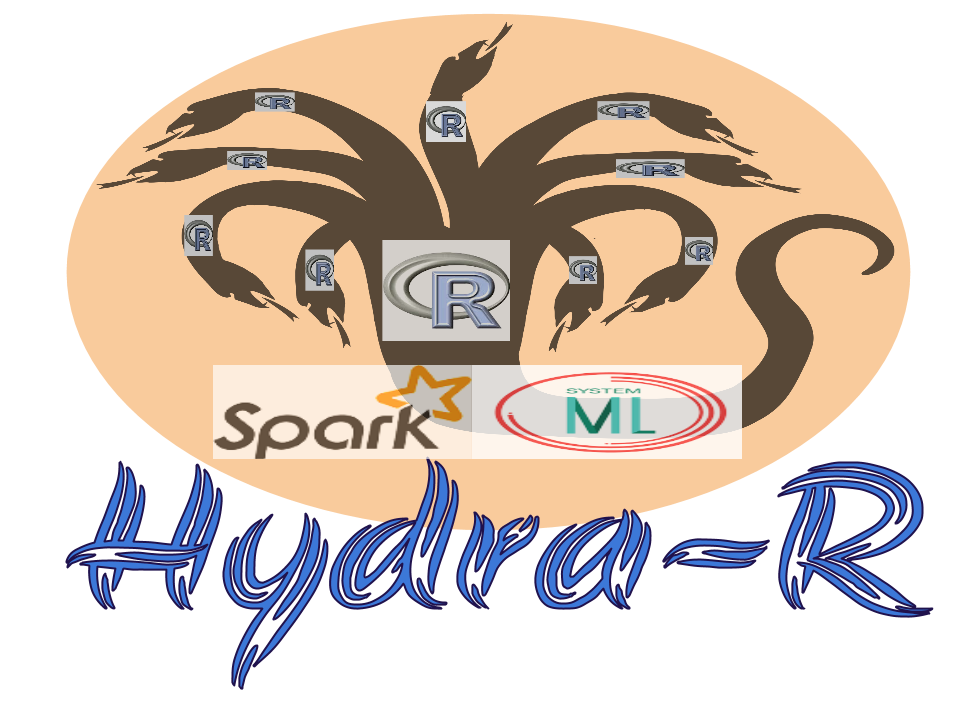

## HydraR: A Hybrid Approach to ML/Stats using R, SystemML and Apache Spark

## HydraR Key Features 

 - HydraR is the git downloadable open source R pacakge from IBM 
 - Created on the top of Apache SparkR and SystemML (so it supports features from both the 
 - Act as the R bridge between SparkR and SystemML.
 - Provides a collection of canned algorithms.
 - Ability to create custom ML algorithm.
 - APIs are more friendlier to the R user.

## HydraR Architecture

### Simplified Architecture

### Detailed Architecture

## Supported Features (Technical Details)

 - Have six algorithms supported
     - GLM, MultiLogReg, SVM
 - Have sampling support
 - Have the transform support
 - Support Spark 2.0.0 and IOP 4.3 preview
 - Partition Execution based on SparkR
 - minor QA, Docs, Examples and Demo 

