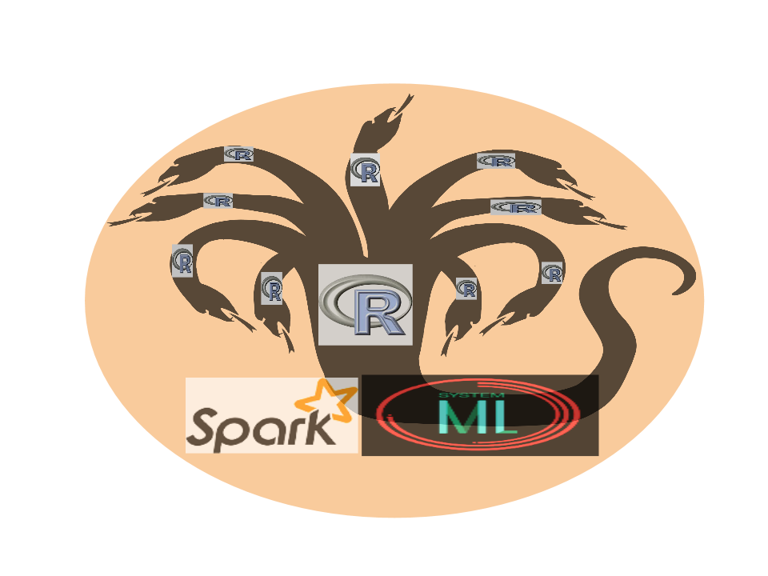

# 

## __**How to Use R4ML**__

   Congratulations, you just installed R4ML, now you are ready to do scalable
   data analysis and machine learning.

   - We have comprehensive examples at [examples folder](../R4ML/inst/examples)

   - Our unit-test also provides great examples at [unittests](../R4ML/tests/testthat)

  <!--
  - We have some vignettes for at [vignettes](../R4ML/vignettes) 
  -->

   - Here is very simple example of running the linear model with an R script


  ```
    # In this example, we're going to use iris data set, and we'll use linear regression
    # model to predict Sepal Length using the rest of the fearures as predictors.

    # load R4ML library
    library(R4ML)

    r4ml.session(master = "local[*]", sparkHome = "/path/to/apache/spark")

    # create r4ml dataframe from iris data
    iris.df <- as.r4ml.frame(iris)

    # We need to dummycode Species for regression model using preprocessing
    # this returns a list containing $data $metadata
    pp <- r4ml.ml.preprocess(iris.df, transformPath = "/tmp",
                               dummycodeAttrs = c("Species"))

    # convert preprocessed data to r4ml.matrix
    iris.mat <- as.r4ml.matrix(pp$data)

    # create train/test split
    ml.coltypes(iris.mat) <- c("scale", "scale", "scale", "scale",
                               "nominal", "nominal", "nominal")
    s <- r4ml.sample(iris.mat, perc=c(0.2,0.8))
    test <- s[[1]]
    train <- s[[2]]

    # fit linear regression model.
    iris.model <- r4ml.lm(Sepal_Length ~ . , data = train, intercept = TRUE)

    # we can check the coefficients of model by using coef function
    coef(iris.model)

    # we can now make predictions using test data set
    preds <- predict(iris.model, test)

    # the predict function calculates several statitics just like r4ml.lm.
    preds$statistics

    r4ml.session.stop()
   ```